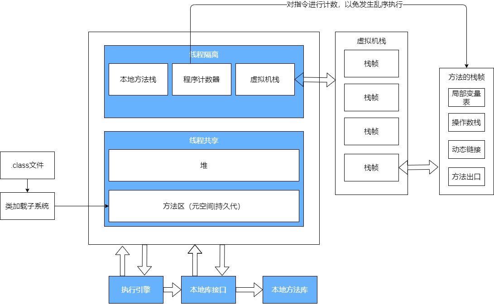

## 内存管理



### 方法区 （元空间/持久代）

**线程共享**，存放类加载之后存放类的数据结构，静态常量，JIT(即时编译器)编译后代码也在方法区存放

### 堆区

**线程共享**，对象所在的区域，也是垃圾回收的主要场所

### 虚拟机栈

按照方法执行的顺序，先进后出

#### 栈帧

* 局部变量表
* 操作数栈
* 动态链接
* 方法出口

来看看一段简单的代码，主要分析demo()方法

```java
public class Main {

    public static void main(String[] args){
        demo();
    }

    public static int  demo(){
        int a = 20;
        int b = 30;
        int c = (a + b) * 100;
        return c;
    }
}
```

这里的demo（）方法会有一个局部变量表

.png)

赋默认值，真正使用的时候才会对其进行初始化。

我们把编译好了的java文件利用javap命令对class文件进行反汇编 `javap -c Main.class`

```java
Compiled from "Main.java"
public class Main {
  public Main();
    Code:
       0: aload_0
       1: invokespecial #1                  // Method java/lang/Object."<init>":()V
       4: return

  public static void main(java.lang.String[]);
    Code:
       //后面的#加数字代表动态链接，不然程序无法准确的找到
       // (执行静态方法#2【#2就代表一个静态方法，通过#2就可以准确找到所要执行的方法】)
       0: invokestatic  #2                  
       3: pop		//将栈顶一个字长的数据弹出来
       4: return

  public static int demo();
    Code:
       0: bipush        20  //将一个8位带符号整数（20）压入栈
       2: istore_0			//将操作数栈中栈顶int类型的值存入局部变量0
       3: bipush        30	//将一个8位带符号整数（30）压入栈
       5: istore_1			//将操作数栈中栈顶int类型的值存入局部变量1
       6: iload_0			//将局部变量0中的int类型值装载到操作数栈
       7: iload_1			//将局部变量1中的int类型值装载到操作数栈
       8: iadd				//操作数栈中的前两个int弹出并相加，并将结果压入操作数栈顶
       9: bipush        100	//将一个8位带符号整数（100）压入栈
      11: imul				//操作数栈中的前两个int弹出并相乘，并将结果压入操作数栈顶
      12: istore_2			//将操作数栈中栈顶int类型的值存入局部变量2
      13: iload_2			//将局部变量2中的int类型值装载到操作数栈
      14: ireturn			//将操作数栈中的int值返回
          
      //那么前面的序号什么意思呢，这里就是程序计数器为了保证指令的正确执行所需要的序号
}
```

从注释可以很清晰的看出来没一步都在做什么，至于JVM指令都代表什么可以看一下这个记录文档[指令详解]([https://jontree.github.io/2020/04/03/JVM-%E6%93%8D%E4%BD%9C%E6%8C%87%E4%BB%A4%E8%AE%B0%E5%BD%95%E4%B8%80%E8%A7%88](https://jontree.github.io/2020/04/03/JVM-操作指令记录一览))

至于动态上面的动态链接，这里重新给一个例子。

```java
class Demo{

}

public class Main {
    public static void main(String[] args){
        Demo demo = new Demo();
    }
}
```

这次我们使用输出信息更加精确的`javap -v Main.class`

```java
Compiled from "Main.java"
public class Main
  minor version: 0
  major version: 56
  flags: (0x0021) ACC_PUBLIC, ACC_SUPER
  this_class: #4                          // Main
  super_class: #5                         // java/lang/Object
  interfaces: 0, fields: 0, methods: 2, attributes: 1
Constant pool://这里声明一些映射，方便下面链接
   #1 = Methodref          #5.#21         // java/lang/Object."<init>":()V
   #2 = Class              #22            // Demo
   #3 = Methodref          #2.#21         // Demo."<init>":()V
   #4 = Class              #23            // Main
   #5 = Class              #24            // java/lang/Object
   #6 = Utf8               <init>
   #7 = Utf8               ()V
   #8 = Utf8               Code
   #9 = Utf8               LineNumberTable
  #10 = Utf8               LocalVariableTable
  #11 = Utf8               this
  #12 = Utf8               LMain;
  #13 = Utf8               main
  #14 = Utf8               ([Ljava/lang/String;)V
  #15 = Utf8               args
  #16 = Utf8               [Ljava/lang/String;
  #17 = Utf8               demo
  #18 = Utf8               LDemo;
  #19 = Utf8               SourceFile
  #20 = Utf8               Main.java
  #21 = NameAndType        #6:#7          // "<init>":()V
  #22 = Utf8               Demo
  #23 = Utf8               Main
  #24 = Utf8               java/lang/Object
{
  public Main();
    descriptor: ()V
    flags: (0x0001) ACC_PUBLIC
    Code:
      stack=1, locals=1, args_size=1
         0: aload_0
         1: invokespecial #1                  // Method java/lang/Object."<init>":()V
         4: return
      LineNumberTable:
        line 5: 0
      LocalVariableTable:
        Start  Length  Slot  Name   Signature
            0       5     0  this   LMain;

  public static void main(java.lang.String[]);//main方法
    descriptor: ([Ljava/lang/String;)V
    flags: (0x0009) ACC_PUBLIC, ACC_STATIC
    Code:
      stack=2, locals=2, args_size=1
         //new 指令在堆中创建一个Java对象，并将该对象的地址压入操作数栈
         0: new           #2                  // class Demo
         //复制栈顶一个字长的数据（这里是上面创建的java对象的地址，此时操作数栈中有两个地址）
         3: dup
         //使用栈顶的地址调用方法并弹出栈顶
         4: invokespecial #3                  // Method Demo."<init>":()V
         //将引用类型或returnAddress类型值存入局部变量1(这里将剩下的一份地址存到局部变量里面去了)
         7: astore_1
         8: return
      LineNumberTable:
        line 7: 0
        line 8: 8
      LocalVariableTable:
        Start  Length  Slot  Name   Signature
            0       9     0  args   [Ljava/lang/String;
            8       1     1  demo   LDemo;
}
```

### 程序计数器

当前线程执行的字节码的位置指示器

### 本地方法栈 

为JVM提供使用native方法的服务大致结构和虚拟机栈差不多 

## 垃圾回收

STW（stop the world）：停止其他所有工作

Minor GC：轻量级，耗时短，会出现STW

Full GC：重量级，耗时长，会出现STW

### 分代垃圾回收

#### 新生代

对象会被优先被分配到这个地方

#### 老年代

当对象满足一定条件之后会被放到老年代

**注意**：java8之后老年代在Full GC之前是会执行一次Minor GC的，如果内存依然不足，才会执行Full GC

### 算法

* 标记清除

  优点：快

  缺点：会出现内存碎片，导致大对象进来会直接进入老年代

  

* 标记整理

  解决上面的的内存碎片问题

* 复制

  From区和To区来实现这个算法，这两个区域分别是Survivor 0和Survivor 1

  > 这也是为什么需要交换的原因，To区永远保持空白