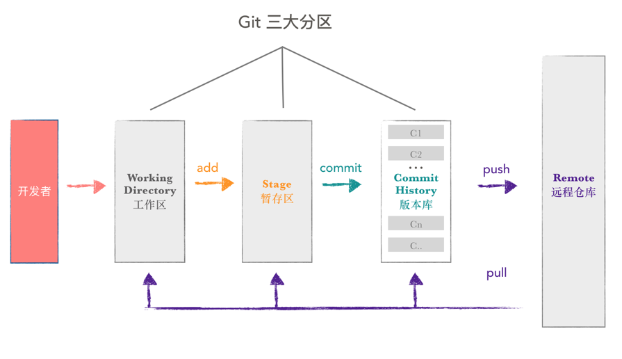

# git

链接在手，天下你有，自己去详细学习吧：[ 史上最浅显易懂的Git教程！ ](https://www.liaoxuefeng.com/wiki/896043488029600)

## 概念

### 工作区（Working Directory）

是我们直接编辑的地方，例如 idea 打开的项目，记事本打开的文本等，肉眼可见，直接操作。

### 暂存区（Stage 或 Index）

数据暂时存放的区域，可在工作区和版本库之间进行数据的友好交流。

### 版本库（commit History）

存放已经提交的数据，push 的时候，就是把这个区的数据 push 到远程仓库了。



## 常用命令讲解

### Git 常用命令汇总

#### 1、远程仓库相关命令

- 检出仓库：$ git clone [remoteName]
- 查看远程仓库：$ git remote -v
- 添加远程仓库：$ git remote add [name] [url]
- 删除远程仓库：$ git rm [name]
- 修改远程仓库：$ git remote set-url --push [name] [newUrl]
- 拉取远程仓库：$ git pull [remoteName] [localBranchName]
- 推送远程仓库：$ git push [remoteName] [localBranchName]

*如果想把本地的某个分支test提交到远程仓库，并作为远程仓库的master分支，或者作为另外一个名叫test的分支，如下：*

- $ git push origin test:master         // 提交本地test分支作为远程的master分支
- $git push origin test:test              // 提交本地test分支作为远程的test分支

#### 2、分支(branch)操作相关命令

- 查看本地分支：$ git branch

- 查看远程分支：$ git branch -r

- 创建本地分支：$ git branch [name] ----注意新分支创建后不会自动切换为当前分支

  ```shell
  git branch test
  ```

- 切换分支：$ git checkout [name]

  ```shell
  git checkout test
  ```

- 创建新分支并立即切换到新分支：$ git checkout -b [name]

  ```shell
  git checkout -b test
  ```

- 删除分支：$ git branch -d [name] ---- -d选项只能删除已经参与了合并的分支，对于未有合并的分支是无法删除的。如果想强制删除一个分支，可以使用-D选项

  ```shell
  git branch -d test
  
  #or
  
  git branch -D test
  ```

- 合并分支：$ git merge [name] ----将名称为[name]的分支与当前分支合并

- 创建远程分支(本地分支push到远程)：$ git push origin [name]

- 删除远程分支：$ git push origin :heads/[name] 或 $ git push origin :[name]

- *创建空的分支：(执行命令之前记得先提交你当前分支的修改，否则会被强制删干净没得后悔)*

- $git symbolic-ref HEAD refs/heads/[name]

- $rm .git/index

- $git clean -fdx

#### 3、版本(tag)操作相关命令

- 查看版本：$ git tag
- 创建版本：$ git tag [name]
- 删除版本：$ git tag -d [name]
- 查看远程版本：$ git tag -r
- 创建远程版本(本地版本push到远程)：$ git push origin [name]
- 删除远程版本：$ git push origin :refs/tags/[name]
- 合并远程仓库的tag到本地：$ git pull origin --tags
- 上传本地tag到远程仓库：$ git push origin --tags
- 创建带注释的tag：$ git tag -a [name] -m 'yourMessage'

#### 4、忽略一些文件、文件夹不提交

[.gitignore文件详解](https://jontree.github.io/2019/10/04/gitignore%E5%BF%BD%E7%95%A5%E6%96%87%E4%BB%B6%E6%80%BB%E7%BB%93)

### 附页： Git 常用命令速查

- git branch 查看本地所有分支
- git status 查看当前状态
- git commit 提交
- git branch -a 查看所有的分支
- git branch -r 查看远程所有分支
- git commit -am "init" 提交并且加注释
- git remote add origin git@192.168.1.119:ndshow
- git push origin master 将文件给推到服务器上
- git remote show origin 显示远程库origin里的资源
- git push origin master:develop
- git push origin master:hb-dev 将本地库与服务器上的库进行关联
- git checkout --track origin/dev 切换到远程dev分支
- git branch -D master develop 删除本地库develop
- git checkout -b dev 建立一个新的本地分支dev
- git merge origin/dev 将分支dev与当前分支进行合并
- git checkout dev 切换到本地dev分支
- git remote show 查看远程库
- git add .
- git rm 文件名(包括路径) 从git中删除指定文件
- git clone git://github.com/schacon/grit.git从服务器上将代码给拉下来
- git config --list 看所有用户
- git ls-files 看已经被提交的
- git rm [file name] 删除一个文件
- git commit -a 提交当前repos的所有的改变
- git add [file name] 添加一个文件到git index
- git commit -v 当你用－v参数的时候可以看commit的差异
- git commit -m "This is the message describing the commit" 添加commit信息
- git commit -a -a是代表add，把所有的change加到git index里然后再commit
- git commit -a -v 一般提交命令
- git log 看你commit的日志
- git diff 查看尚未暂存的更新
- git rm a.a 移除文件(从暂存区和工作区中删除)
- git rm --cached a.a 移除文件(只从暂存区中删除)
- git commit -m "remove" 移除文件(从Git中删除)
- git rm -f a.a 强行移除修改后文件(从暂存区和工作区中删除)
- git diff --cached 或 $ git diff --staged 查看尚未提交的更新
- git stash push 将文件给push到一个临时空间中
- git stash pop 将文件从临时空间pop下来

－－－－－－－－－－－－－－－－－－－－－－－－－－－－－－

- git remote add origin it@github.com:username/Hello-World.git
- git push origin master 将本地项目给提交到服务器中

－－－－－－－－－－－－－－－－－－－－－－－－－－－－－－

- git pull 本地与服务器端同步

－－－－－－－－－－－－－－－－－－－－－－－－－－－－－－

- git push (远程仓库名) (分支名) 将本地分支推送到服务器上去。
- git push origin server fix:awesome branch

－－－－－－－－－－－－－－－－－－－－－－－－－－－－－－

- git fetch 相当于是从远程获取最新版本到本地，不会自动merge
- git commit -a -m "log_message" (-a是提交所有改动，-m是加入log信息) 本地修改同步至服务器端 ：
- git branch branch_0.1 master 从主分支master创建branch_0.1分支
- git branch -m branch_0.1 branch_1.0 将branch_0.1重命名为branch_1.0
- git checkout branch_1.0/master 切换到branch_1.0/master分支
- du -hs
- git branch 删除远程branch
- git push origin:branch_remote_name
- git branch -r -d branch_remote_name

－－－－－－－－－－－－－－－－－－－－－－－－－－－－－－

初始化版本库，并提交到远程服务器端

- mkdir 

  新建一个文件夹，一个空格后接你的文件夹的名字

- cd 

  进入你的名字

- git init本地初始化

- touch README

- git add README添加文件

- git commit -m 'first commit'

- git remote add origin git@github.com:daixu/WebApp.git增加一个远程服务器端


细讲我怕又是几小时 ，下面我给你们简单介绍几个常用命令，也就是我门作业会用到的。也是今后我们用到最多的。

 

# github注册

链接在手，天下你有，自己去注册吧：[github注册链接](https://github.com/join?source=header-home)

好了现在你们什么都有了，你就是一个成熟的程序员的了


# 接下来我们来偷懒

你觉得上面的git命令复杂可以先不看，github里面新建工程啥的太麻烦可以先不看。

打开你神奇的idea，并打开你的项目

假如现在你要上传你的项目到你的github，你只需要 点  点  点


这一步如果你还没登陆的话会要求你登陆，我这已经登陆了所以直接弹出了这个框，点击share就会帮你在本地执行`git init` `git add .` `git add remote` 你的github里面创建仓库并把你的整个工程传上去，一把梭爽不爽 爽


好了正式开始你的程序员生活了，如何拉网络去你仓库的更新呢？只需  **点**   **点 **   **点**


其实拉取对现阶段的你们还没啥用，毕竟远程的就是你本地的本地提交的，但是你和别人合作开发的时候就需要拉取了，为啥呢，因为可能他改了之后提交到远程了呀，你需要更新本地到远程的最新版


那如何提交呢？ 只需要  **点  点  点** 


中间那个大框框里写你这次提交描述，点击下面的，commit就会提交到本地的版本库，你要是想提交到版本库之后直接把代码更新到远程github的仓库里，右边那个小三角，然后commit and push，提交到本地时同时上传远程，会出现，如下页面：


点击push就可以了。


那么问题来了，要是你就想直接commit在本地，等今天工作完了，再push到远程呢？只需   **点**   **点**    **点**


好了 ，现在为止你已经会了基本的git操作，是不是超简单。


好了我来学习更多的git操作，对你自己说，**”我  。 才  。  不  。  要  。   记  。   命  。  令。“**

假如你现在突发奇想有另外一个想法，想创建一个测试分支，来写那个功能，咋啦呢？ 只需  **点    点    点**

 

点击最下面的git 就能唤出这个窗口，这个英文应该大家都能看懂吧，这个英文看不懂就退群吧，思考一下怎么上大学几个月就把高中英语忘完了。


好了然后，你写了很多了，也提交了几次之后，你突然发现前面提交的那个有问题，不想提交了那咋办呢？ 只需**点    点    点**


那就退到你刚刚新提交的那个版本前面一个呗，例如我觉得`test2`有问题那我就右键点击`test1`，然后


这样你刚刚的修改的提交就没了，但是如果你选择的时mix的话，你的修改还是会在的，变成没有提交状态了，我来解释一下这四个选项。

* `soft`重置版本库但是暂存区和工作区不会
* `mixed`会充值版本库和暂存区，但是工作区还在
* `hard`会重置版本库暂存区工作区（危险操作，但是找都是可以找回来的）
* `keep`重置所有的但是会保留文件


如果你完全不要本地的所有更改了，可以直接hard到最近一个commit（危险操作，虽然我经常做）


好了现在假如你完成了你突发奇想的功能感觉还不错，想把test分支合并到主分支要咋办呢？ 还是**点    点    点**

先切换回主分支


然后

点击test分支


这样就合并啦

这也太简单了吧