title: hexo+admin+windows+linux服务器的综合博客平台
author: Jon

tags:

  - 踩坑

  - 浪费了大好青春
  categories:

  - 兴趣
  date: 2019-10-03 16:43:00

  
---
# windows下的hexo+github博客搭建

## 博客搭建

不多说这里放上[大神的知乎](https://zhuanlan.zhihu.com/p/35668237)，点击自己按照流程来做就好了，下面我做一个归纳整理，也留作备份。

### 安装Node.js

> * [windows下载链接](https://link.zhihu.com/?target=https%3A//nodejs.org/dist/v9.11.1/node-v9.11.1-x64.msi)
>
> * 下载之后一路next就好，环境变量默认会把帮你配好
>
> * 最后安装好之后，按`Win+R`打开命令提示符，输入`node -v`和`npm -v`，如果出现版本号，那么就安装成功了。
> * 也有没有自动配的情况，可以手动配一下。

### 添加国内镜像源

> 如果没有K X S W(这是啥大家都明白吧)的话，可以使用阿里的国内镜像进行加速。
>
> ```bash
> npm config set registry https://registry.npm.taobao.org
> ```

### 安装Git

> * [Git的下载链接](https://git-scm.com/download/win)
> * 安装选项还是全部默认，只不过最后一步添加路径时选择`Use Git from the Windows Command Prompt`，这样我们就可以直接在命令提示符里打开git了。
> * 安装完成后在命令提示符中输入`git --version`验证是否安装成功。
> * 同样如果没有找到版本号需要手动配置

### 注册Github账号

> * [注册地址](https://link.zhihu.com/?target=https%3A//github.com/)
>
> * 注册完成之后进入主页
>
> * 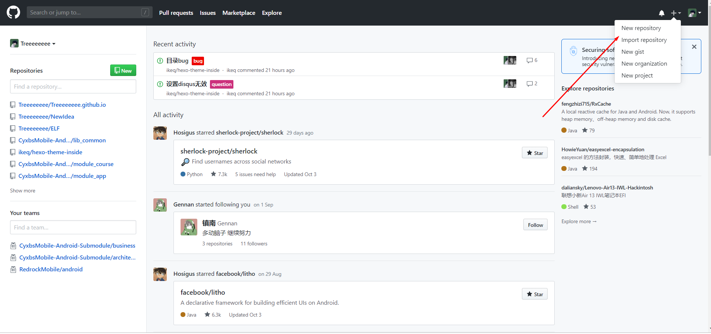
>
>   点击新建项目
>
> * 项目名称是你的github用户名加.github.io 
>
>   > 例如: `XXXXX.github.io`
>   >
>   > 同时也可以勾选一下Redme.md
>
>   
>
> * 然后按照下面的流程你就可以获得一个最简单的博客
>
>   * 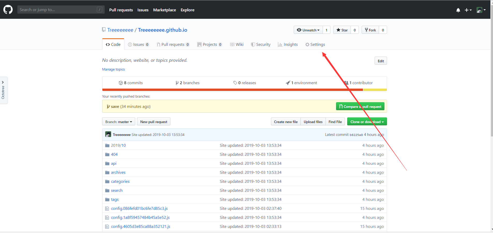
>
>   * 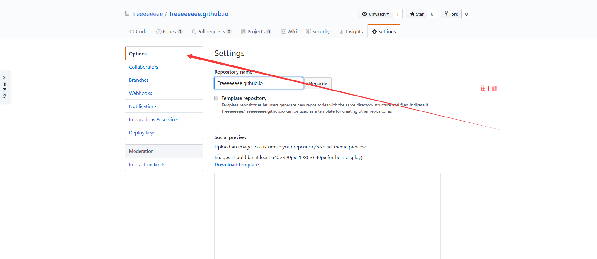
>   * 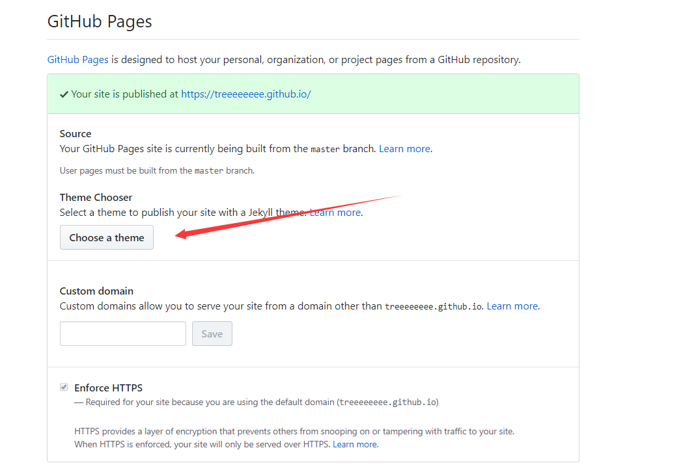
>   * 进去之后随便选一个

### 安装Hexo

在合适的地方新建一个文件夹，用来存放自己的博客文件，比如我的博客文件都存放在`D:\study\program\blog`目录下。

在该目录下右键点击`Git Bash Here`，打开git的控制台窗口，以后我们所有的操作都在git控制台进行，就不要用Windows自带的控制台了。

定位到该目录下，输入`npm i hexo-cli -g`安装Hexo。会有几个报错，无视它就行。

安装完后输入`hexo -v`验证是否安装成功。

然后就要初始化我们的网站，输入`hexo init`初始化文件夹，接着输入`npm install`安装必备的组件。

这样本地的网站配置也弄好啦，输入`hexo g`生成静态网页，然后输入`hexo s`打开本地服务器，然后浏览器打开[http://localhost:4000/](https://link.zhihu.com/?target=http%3A//localhost%3A4000/)，就可以看到我们的博客啦，效果如下：

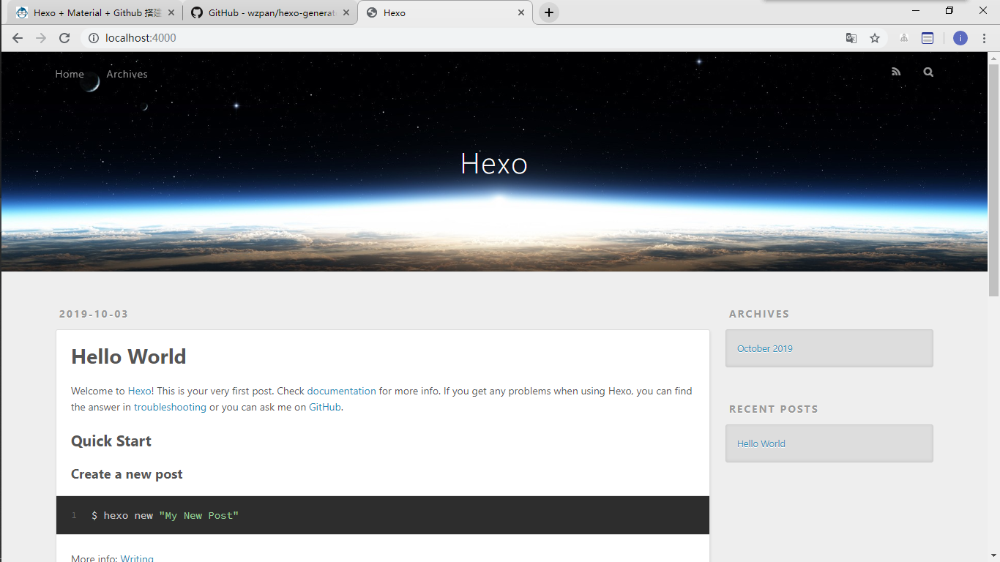

按`ctrl+c`关闭本地服务器。

### 连接Github与本地

首先右键打开git bash，然后输入下面命令：

```bash
git config --global user.name "godweiyang"
git config --global user.email "792321264@qq.com"
```

用户名和邮箱根据你注册github的信息自行修改。

然后生成密钥SSH key：

```bash
ssh-keygen -t rsa -C "792321264@qq.com"
```

打开[github](https://link.zhihu.com/?target=http%3A//github.com/)，在头像下面点击`settings`，再点击`SSH and GPG keys`，新建一个SSH，名字随便。

git bash中输入

```bash
cat ~/.ssh/id_rsa.pub
```

将输出的内容复制到框中，点击确定保存。

输入`ssh -T git@github.com`，如果如下图所示，出现你的用户名，那就成功了。

打开博客根目录下的`_config.yml`文件，这是博客的配置文件，在这里你可以修改与博客相关的各种信息。

修改最后一行的配置：

```bash
deploy:
  type: git
  repo: 
  branch: master
```

repository或者repo修改为你自己的github项目地址

> 我这里默认的是使用`ssh`，如果想使用`https`点击更换就好了
>
> * 我推荐使用ssh，毕竟你已经在你的github中添加了你本机的ssh，免得再输密码
> * 如果不懂ssh可以先使用https，后面我们做服务器的自动git用ssh会更好，如果不需要，而且是在windows下使用的话那就`https`的吧，没啥关系，windows有记住密码的功能

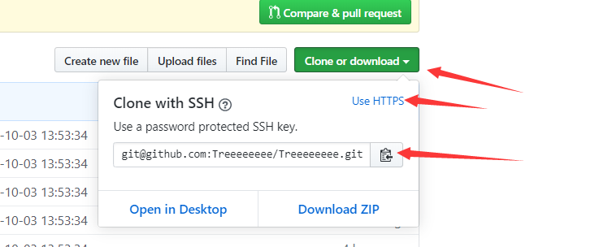

### 写文章、发布文章

首先在博客根目录下右键打开git bash，安装一个扩展`npm i hexo-deployer-git`。

然后输入`hexo new post "article title"`，新建一篇文章。

> article title 替换成你要写的文章的名字，需要注意一下：
>
> * 最好使用英文，使用中文的话博客的url会非常长
>
> * 如果想插入图片的话，打开你的博客目录里面的`_config.yml`找到`post_asset_folder: `属性，并复制未`true`，这样生成一篇新文章时，会在
>
>   ```
>   \source\_posts
>   ```
>
>   目录下生成一个 文章名.md 文件外，附带生成一个与 文章名 同名的文件夹，可以用它来存放这篇文章的所有资源，比如图片，附件等。这样在文章中插入图片使用相对路径就可以即在本地书写的时候看到图片，又在生成的博客中看到，例如：
>
>   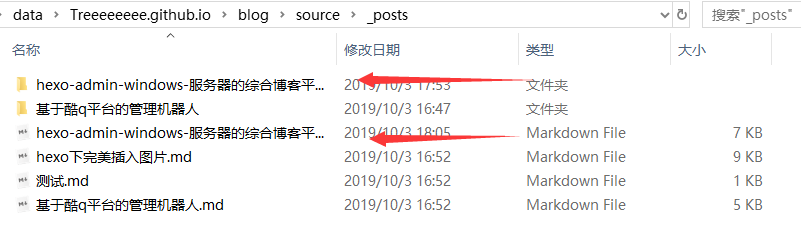
>
>   在文章中直接这样插入，就可以完美插入图片。详细可以借鉴我[另外一篇博客](https://treeeeeeee.github.io/2019/10/01/hexo%E4%B8%8B%E5%AE%8C%E7%BE%8E%E6%8F%92%E5%85%A5%E5%9B%BE%E7%89%87)
>
>   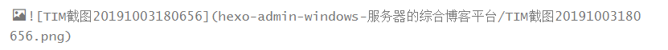
>
> * 这里推荐一个超好用加方便的markdown编辑软件`Typora`，而且恰好支持这种图片资源文件，设置一下可以把任意来源图片直接弄到对应文件夹
>
>   > 
>   >
>   > 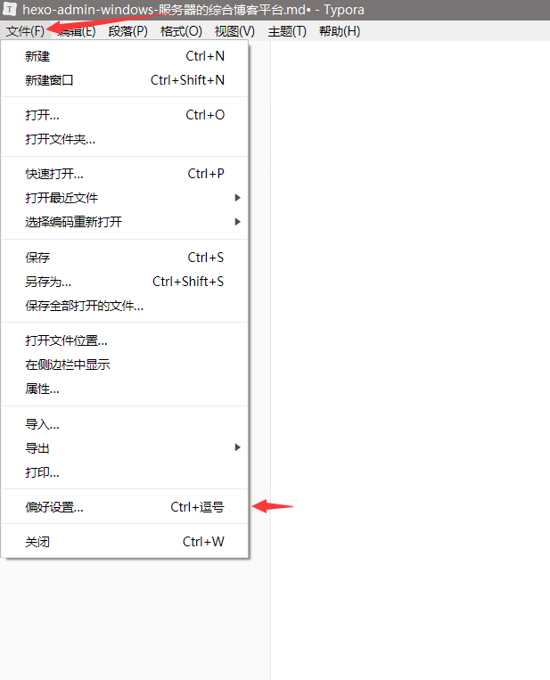
>   >
>   > 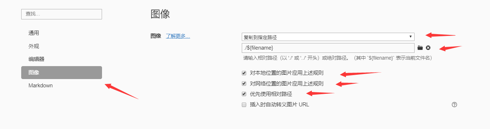
>   >
>   > **这样设置以后你不管是从网络上来的图片还是任意地方拖动的进来的图片都会自动给你放到这个文件夹**

然后打开`D:\study\program\blog\source\_posts`的目录，可以发现下面多了一个文件夹和一个`.md`文件，一个用来存放你的图片等数据，另一个就是你的文章文件啦。

编写完markdown文件后，根目录下输入`hexo g`生成静态网页，然后输入`hexo s`可以本地预览效果，最后输入`hexo d`上传到github上。这时打开你的github.io主页就能看到发布的文章啦。

### 绑定域名

现在默认的域名还是`xxx.github.io`，是不是很没有牌面？想不想也像我一样弄一个专属域名呢，首先你得购买一个域名，xx云都能买，看你个人喜好了。

以我的百度云为例，如下图所示，添加两条解析记录：


然后打开你的github博客项目，点击`settings`，拉到下面`Custom domain`处，填上你自己的域名，保存：


这时候你的项目根目录应该会出现一个名为`CNAME`的文件了。如果没有的话，打开你本地博客`/source`目录，我的是`D:\study\program\blog\source`，新建`CNAME`文件，注意没有后缀。然后在里面写上你的域名，保存。最后运行`hexo g`、`hexo d`上传到github。

### 备份博客源文件

有时候我们想换一台电脑继续写博客，这时候就可以将博客目录下的所有源文件都上传到github上面。

* **我的备份方法**

  > 随便找个文件夹，右键打开git bash，依次执行以下命令
  >
  > ```
  > git clone 你的博客仓库地址
  > git checkout -b backup
  > ```
  >
  > 然后删除你拉下来的所有东西文件夹，如果你开了隐藏文件夹也可见的话别把`.git`文件夹删除了，如果没开就放心删除所有文件吧（看见`.git`别动就对了）
  >
  > 然后把你你的整个博客文件夹移动到这里，并删除你博客文件下里面所有叫`.gitignore`的文件，通常来说，博客源码根目录有一个，主题文件夹里面都有
  >
  > > `.gitignore`文件是用来说明那些东西不被git push的，具体请自行百度
  >
  > 然后继续依次执行以下命令
  >
  > ```
  > git add .
  > git commit -s -m "backup"
  > git push
  > ```
  >
  > 等待完成就可以在任何地方直接拉下来使用了，在其他地方使用有以下几个要注意的：
  >
  > * 环境必须安装这个没得说
  >
  > * 如果你是使用shh来部署的项目需要把这台设备的生成的ssh添加到你的github账号里
  >
  >   > 指的是你前面属性`repo : `是用的https的还是ssh的

* 其他备份方法(该内容是粘贴复制)

  > 首先在github博客仓库下新建一个分支`hexo`，然后`git clone`到本地，把`.git`文件夹拿出来，放在博客根目录下。
  >
  > 然后`git branch -b hexo`切换到`hexo`分支，然后`git add .`，然后`git commit -m "xxx"`，最后`git push origin hexo`提交就行了。

### 博客源代码下载

### 个性化设置（matery主题）

### 常见问题及解答（FAQ）

## 个性化设置|更换主题|

### 效果图

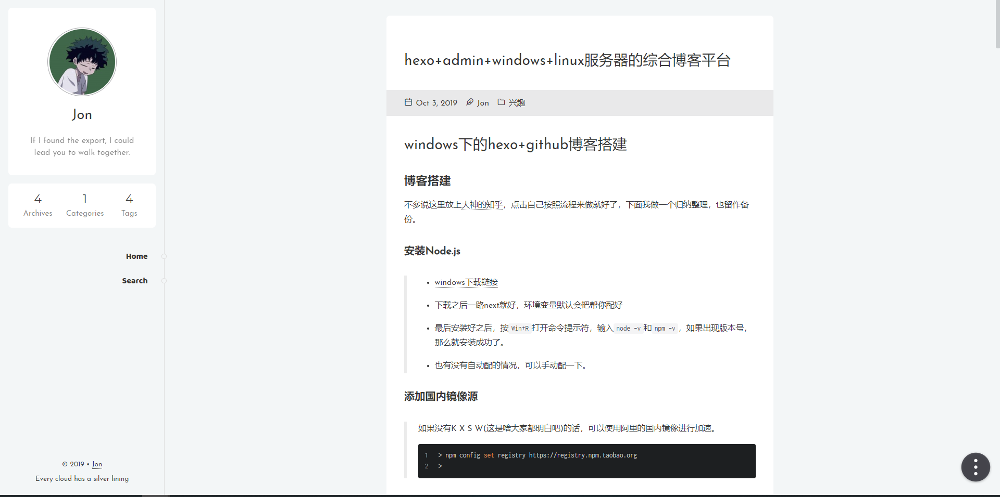

[我的博客地址](https://treeeeeeee.github.io)有什么问题可以在文章下评论留言

### inside主题

* 直接下载源码放到你的博客源码目录的themes目录里面，并修改`_config.yml`文件中`theme: `属性，然后执行：

  ```bash
  hexo g
  hexo s
  ```

  浏览器访问：localhost:4000 就能直接看到效果了

* 具体配置我就不详细说明了可以去看主题制作者的博客：[链接](https://blog.oniuo.com/theme-inside)


