title: java面向对象-接口和其他的类
tags:

  - java
  - 课件
categories:
  - java
author: Jon
date: 2019-10-12 14:34:00

---

# 前言：

**听我讲课也就图一乐，要想真学到东西还是得自己看书。**

**大学学习最重要的莫过于是自学能力，我归纳的东西也许细节上有可能和书上有差异，因为我毕竟不是专业的，要想深究还是得对照书去看，我这只是对你们的一个引导**。


**万物皆可为对象那么对象与对象之间肯定不是独立的，上节课谢磊学长讲了类的继承，那是一种最广泛的关系。今天我们了解一点更加抽象一点的东西，但是只要大家认真听我想还是会有所明白。**


# 先来吹吹概念 

小恐龙镇压，让学习不再困难：

                                                           ！

## 接口


> 接口最通俗的来讲就是一种统一的规范或者叫做协议，接口这个名称有点晦涩难懂，但是其实接口就是一个基于双方或者多方的协议
>
> 下面举几个例子：
>
> * 你们用的插座的插孔可以被叫做接口（协议），因为这个规范存在，在中国无论你是什么充电器，只要是这个充电口，那么我就会给你输出电流，至于你充什么，干什么我都不管。
> * 你去面试，他说你必须有本科及以上的文凭且必须过了四级才能有面试资格，这也算事接口（协议），因为如果你没有这些东西，就不能去面试，至于你是怎么努力学习拿到本科文凭和怎么努力拿到四级证书的，一律不管。
> * 我今天布置了作业，我要收的是我布置的这些作业，至于你们每个人怎么去做出来我是不管的，那我布置的作业就是接口（协议），你们按照题目实现相应的功能就好，最后验收我也只会根据我布置的作业的应该输出的结果来看你是不是完成作业。（当然，当然我在作业文件中指出你不能用啥，我还是会看的具体细节的）
>
> 现在，接口你们应该都应该大致明白是什么了吧。

### 接口有什么作用？或者接口存在的必要性？

> 还是上一节的例子，如果国家没有规定这个插座的标准，那每个厂家的有自己的一套，你买公牛的插座就得买支持公牛插座的电器。出去在中国其他地方旅游你就只有背着各式各样的转接头。嗯，锻炼身体也是好事嘛。
>
> 所以国家就制定了标准。
>
> 所以编程中接口的重要性也就凸显出来了

### 编程中的接口？

> **场景案例**：
>
> 现在开始你就是bat当中的员工之一，你的上级太多了，都要吩咐你做事：
>
> * 大boss想要员工会帮他给买部手机
> * 二boss想要员工会销售一套房子
> * 三boss想要员工会帮忙搭讪小姐姐
> * 四boss想要员工会跟他一起打游戏
> * ..............
>
> 一共有不知道多少个boss，总之你是底层员工嘛。
>
> 那么问题来了，这个员工类究竟得怎么设计呢，真是一个难题，而且老板门想要叫这个员工去做事的时候怎么知道这个员工会呢？
>
> 答案：
>
> 其实很简单，把这些行为统统抽象成接口。
>
> 例如：
>
> 定义下面一些接口：
>
> ```java
> public interface BuyCellPhone {
>     public void buycellphone();
> }
> ```
>
> ```java
> public interface BuyHouse {
>     public void buyHouse();
> }
> ```
>
> ```java
> public interface TrickGirl {
>     public void trickGirl();
> }
> ```
>
> ```java
> public interface PlayingGamesTogether {
>     public void playingGameTogether();
> }
> ```
>
> ...............................................................(此处还有无数个接口)
>
> 那么这些接口有什么用呢？
>
> 对应的老板只需要持有自己熟悉的接口的引用，在需要的时候调用方法就好了，而不需要去了解认识每一个人。下面以大老板为例：
>
> 首先必须的有一个实现了这个
>
> ```java
> /**
>  * 实现了买手机这个功能接口的员工
>  */
> public class Staff implements BuyCellPhone {
> 
>     private String name;
>     private String sex;
> 
>     public Staff(String name, String sex) {
>         this.name = name;
>         this.sex = sex;
>     }
> 
>     @Override
>     public void buycellphone() {
>         System.out.println("屁颠屁颠帮老板去买手机");
>     }
> }
> ```
>
> 此时身为老板的只需要只需要这样一个方法，就可以找个员工帮他买手机了，并且他可以完全不用了解这个员工谁，到底是干啥的，但是至少这人是实现了这个接口，就说明是有这个能力的
>
> ```java
> public void lookingForSomeoneToBuyAMobilePhone(BuyCellPhone buyCellPhone) {
>     buyCellPhone.buycellphone();
> }
> ```

## 抽象类

**我都叫抽象类了，你说我抽象不抽象，我觉得我比上面那玩意儿抽象，你说呢？**

###  黄坤坤告诉你到底有多抽象？

**抽象？我叫抽象类我就抽象啦？那hljj是jj吗？**

- **听听抽象类的自白**

  **（抽象类独白）**：

  ​		天生就是用来被别人来继承的，简而言之，只有当爸爸的命，从不当儿子。可能有些事，必须得儿子去做，别直接叫我去做事。

- ”**只当爸爸**“

  说明被继承是绝对需要，大部分抽象类都是没有完整实现类功能的类，等待子类继承去实现，所以它是不可以被实例化成对像的。

- “**有些事必须得儿子去做**”

  说明它可能存在方法是抽象的，必须得子类去具体实现。

- “**别直接叫我做事**”  

  说明它是不可以直接示例化的。

  

### 好了，说完上面牵强的解释，现在我们来看看例子：

  

  


# 好了，开始开飞机了

# 接口

## 基本概念

 接口，英文称作**interface**，在软件工程中，接口泛指供别人调用的方法或者函数。从这里，我们可以体会到Java语言设计者的初衷，它是对**行为**的抽象。在Java中，定一个接口的形式如下： 

```java
public interface InterfaceName {
 
}
```

需要注意的是:

*  接口中的变量会被隐式地指定为public static final变量 

  > 用其他关键词修饰会报错，例如：
  >
  > *  `public static final`，`private`

*  方法会被隐式地指定为public abstract方法且只能是public abstract方法 

  > 用其他关键词会报错，例如：
  >
  > *  `private`、`protected`、`static`、 `final`

 接口是一种极度抽象的类型，它比抽象类更加“抽象”，并且一般情况下不在接口中定义变量。 

 可以看出，允许一个类遵循多个特定的接口。如果一个非抽象类遵循了某个接口，就必须实现该接口中的所有方法。对于遵循某个接口的抽象类，可以不实现该接口中的抽象方法。 

## 回调

可能初识这个名词觉得高大上和陌生，下面我仔细的讲解一下回调到底是什么呢？

**我在知乎上看到一个高赞回答：**

> 你到一个商店买东西，刚好你要的东西没有货，于是你在店员那里留下了你的电话，过了几天店里有货了，店员就打了你的电话，然后你接到电话后就到店里去取了货。在这个例子里，你的电话号码就叫回调函数，你把电话留给店员就叫登记回调函数，店里后来有货了叫做触发了回调关联的事件，店员给你打电话叫做调用回调函数，你到店里去取货叫做响应回调事件。回答完毕。

这个回答在我学习接口时就看到了，但是当时还是一知半解，下面我们用代码来解释一下。

首先我们定义一个接口`Notify`，通知接口

```java
public interface Notify {
    public void call();
}
```

我们定义一个`Shop`类

```java
public class Shop {

    private Notify notify;

    public void registrationNoticeMethod(Notify notify) {
        this.notify = notify;
    }

    public void tellCustomerOutOfStock() {
        System.out.println("对不起，我们这没有货了");
    }

    public void arrivalNotice() {
        if (notify != null) {
            notify.call();
        }
    }
}
```

定义一个顾客类`Customer`，并且让顾客类实现`Notify`这个接口

```java
public class Customer implements Notify {
    long phoneNum = 1234567;
    @Override
    public void call() {
        System.out.println("打电话给" + phoneNum + "通知到货了");
    }

    public void goShopping() {
        System.out.println("出门购物");
    }
}
```

主程序：

```java
 /**
  * 主函数
  */
public class Main {
    public static void main(String[] args) {
        //实例化对象
        Customer customer = new Customer();
        Shop shop = new Shop();

        //顾客出门购物
        customer.goShopping();
        pause();
        shop.tellCustomerOutOfStock();
        pause();
        shop.registrationNoticeMethod(customer);
        //第二天到货了
        System.out.println("第二天");

        shop.arrivalNotice();
    }

    /**
     * 这个函数不用在意，只是为了演示效果，增加暂停
     */
    private static void pause() {
        new Scanner(System.in).nextLine();
    }
}

```

输出：


[代码中的@Override注解说明](#这里其中有个注解)点击进入

## 特殊的接口

函数式接口


## 接口继承接口以及java8之后的接口多继承问题

[详细解释链接](https://colobu.com/2014/11/04/Java-8-default-method-and-multiple-inheritance/)可能失效，我这里简述一下。

#### java中不是没有多继承吗？

**java8之前**

是的，的确java中没有多继承，但是在java中接口是个例外，接口可以多继承，因为接口没有方法体，所以不论实现哪个父接口的中的方法都是没有关系的。

**java8之后**

java8之后出现了接口的默认实现，就像以下的模式：

```java
public interface A {
    default void hhh() {
        System.out.println("我是B");
    }
}
```

```java
public interface B {
    default void hhh() {
        System.out.println("我是C");
    }
}
```

如果有个接口继承前两个接口，就必须把冲突的方法重写

```java
public interface C extends A, B {
    @Override
    default void hhh() {

    }
}
```

如果有个类同时实现这两个接口也需要实现冲突默认方法

```java
public class Test implements B, A {
    @Override
    public void hhh() {

    }
}
```

# 抽象类

## 定义

- 在面向对象的概念中，所有的对象都是通过类来描绘的，但是反过来，并不是所有的类都是用来描绘对象的，如果一个类中没有包含足够的信息来描绘一个具体的对象，这样的类就是抽象类。
- 抽象类除了不能实例化对象之外，类的其它功能依然存在，成员变量、成员方法和构造方法的访问方式和普通类一样。
- 由于抽象类不能实例化对象，所以抽象类必须被继承，才能被使用。也是因为这个原因，通常在设计阶段决定要不要设计抽象类。
- 父类包含了子类集合的常见的方法，但是由于父类本身是抽象的，所以不能使用这些方法。
- 在Java中抽象类表示的是一种继承关系，一个类只能继承一个抽象类，而一个类却可以实现多个接口。

## 怎么使用

#### 抽象类声明

```java
/**
 * 普通的类
 */
public class Test{
    
}

/**
 * 抽象类
 */
public abstract class Test {

}
```

声明一个java抽象类只需要在正常的类的class之前加上`abstract`

#### 抽象方法声明

```java
abstract class A {
    public abstract   void a();
}
```

## 使用时需要注意的：

- 抽象类**不能被实例化**，实例化的工作应该交**由它的子类来完成**，它**只需要有一个引用即可**。

  > ```java
  > /**
  >  * 生物抽象类（因为没有一个具体的实体可以是生物，所以应该被抽象为更高的抽象类）
  >  */
  > public abstract class Biological {
  >     public void alive() {
  > 
  >     }
  > 
  >     public void death() {
  > 
  >     }
  > }
  > ```
  >
  > ```java
  > /**
  >  * 人类，继承生物，可以没有自己的方法，全部是从抽象类继承的非抽象方法（注意：抽象类中有抽象方法子类必须实现）
  >  */
  > public class Person extends Biological {
  > 
  > }
  > ```
  >
  > 最重要的主程序来了，仔细看注释介绍
  >
  > ```java
  > /**
  >  * 主程序，以下只是演示，注释最重要
  >  */
  > public class Main {
  >     public static void main(String[] args) {
  >         Biological biological = new Person();//初始化时将人类的对象赋值给生物的引用时可以的
  >         Person person = new Person();//生成一个人类的对象
  >         biological = person;//将人类的对象复制给生物的引用也是没问题
  >     }
  > }
  > ```

- **抽象方法**必须**由子类来进行重写**。

  > **抽象类**
  >
  > ```java
  > /**
  >  * 生物类
  >  */
  > public abstract class Biological {
  > 
  >     public abstract void getEnergy();//增加了获取能量这个抽象方法
  > 
  >     public void alive() {
  > 
  >     }
  > 
  >     public void death() {
  > 
  >     }
  > }
  > ```
  >
  > 人类
  >
  > ```java
  > /**
  >  * 人类，继承生物，继承了两个非抽象方法，并实现了抽象方法
  >  */
  > public class Person extends Biological {
  > 
  >     @Override
  >     public void getEnergy() {//实现的抽象抽象方法
  > 
  >     }
  > }
  > ```

- 只要**包含一个抽象方法的抽象类**，该方法**必须要定义成抽象类**，不管是否还包含有其他方法。

- 抽象类中**可以包含具体的方法**，当然**也可以不包含抽象方法**。

  ```java
  /**
   * 有抽象方法的抽象类
   */
  public abstract class A {
      public abstract void a();
  }
  ```

  ```java
  /**
   * 没有抽象方法的抽象类
   */
  public abstract class B {
      public void a() {
  
      }
  }
  ```

- 子类中的抽象方法**不能**与父类的抽象方法**同名**。

- `abstract`不能与`final`并列修饰同一个类。

  > 这个显而易见，既然是抽象的，就必须需要时需要被子类实现的，所以不可能时final

- `abstract` 不能与`private`、`static`、`final`或并列修饰同一个方法。

  > `private`:抽象方法，必须是需要被继承的实现的，所以不可以用私有修饰符修饰
  >
  > `static`：同样，抽象方法是需要被实现的，但是静态方法是不可以被重写
  >
  > final：同上

# 抽象类和接口的区别

##  语法层面上的区别 

- **抽象类**可以提供**成员方法的实现细节**，而**接口**中只能存在**public abstract 方法**；
- **抽象类**中的成员变量可以是**各种类型**的，而**接口**中的成员变量只能是**public static final类型**的；
- **接口**中**不能含有静态代码块**以及**静态方法**，而**抽象类**可以有**静态代码块**和**静态方法**；
- 一个类只能继承一个抽象类，而一个类却可以实现多个接口。

## 设计层面上的区别

- 抽象类是对一种**事物的抽象**，即**对类抽象**，而接口是**对行为的抽象**。

- 抽象类是对整个类整体进行抽象，包括属性、行为，但是接口却是对类局部（行为）进行抽象。

- 举个简单的例子，飞机和鸟是不同类的事物，但是它们都有一个共性，就是都会飞。那么在设计的时候，可以将飞机设计为一个类Airplane，将鸟设计为一个类Bird，但是不能将 飞行 这个特性也设计为类，因此它只是一个行为特性，并不是对一类事物的抽象描述。此时可以将 飞行 设计为一个接口Fly，包含方法fly( )，然后Airplane和Bird分别根据自己的需要实现Fly这个接口。然后至于有不同种类的飞机，比如战斗机、民用飞机等直接继承Airplane即可，对于鸟也是类似的，不同种类的鸟直接继承Bird类即可。从这里可以看出，**继承**是一个 "**是不是**"的关系，而 **接口** 实现则是 "**有没有**"的关系。

- 如果一个类继承了某个抽象类，则子类必定是抽象类的种类，而**接口实现则是有没有**、**具备不具备的关系**，比如鸟是否能飞（或者是否具备飞行这个特点），能飞行则可以实现这个接口，不能飞行就不实现这个接口。

- 设计层面不同，抽象类作为很多子类的父类，它是一种模板式设计。而接口是一种行为规范，它是一种模板式设计。什么是模板式设计？

  >  最简单例子，大家都用过ppt里面的模板，如果用模板A设计了ppt B和ppt C，ppt B和ppt C公共的部分就是模板A了，如果它们的公共部分需要改动，则只需要改动模板A就可以了，不需要重新对ppt B和ppt C进行改动。而辐射式设计，比如某个电梯都装了某种报警器，一旦要更新报警器，就必须全部更新。也就是说对于抽象类，如果需要添加新的方法，可以直接在抽象类中添加具体的实现，子类可以不进行变更；而对于接口则不行，如果接口进行了变更，则所有实现这个接口的类都必须进行相应的改动。

## 实际的例子

下面看一个网上流传最广泛的例子：门和警报的例子：门都有open( )和close( )两个动作，此时我们可以定义通过抽象类和接口来定义这个抽象概念：

```java
/**
 * 门的抽象类
 */
public abstract class DoorAbstract {

    public abstract void open();

    public abstract void close();
}
```

　　或者：

```java
/**
 * 门的接口
 */
public interface DoorInterface {

    public void open();

    public void close();
}
```

但是现在如果我们需要门具有**报警alarm( )**的功能，那么该如何实现？下面提供两种思路：

- 将这三个功能都放在抽象类里面，但是这样一来**所有继承于这个抽象类的子类都具备了报警功能**，但是有的门并不一定具备报警功能；
- 将这三个功能都放在接口里面，需要用到**报警功能的类就需要实现这个接口中的open( )和close( )**，也许这个类根本就不具备open( )和close( )这两个功能，比如火灾报警器。

很明显这个属性放到以上任何一个的当中都是不合适的，但是报警又是一个比较广泛的属性，java不支持多继承，所以最好将这个方法抽象到一个接口里面，这就是所谓的对行为抽象：

```java
/**
 * 报警的接口，所有实现了这个接口的类都是有报警这个功能
 */
public interface Alarm {
    public void alarm();
}
```

然后在对这个可以报警的门进行封装：

```java
/**
 * 可以报警的门
 */
public class AlarmDoor extends DoorAbstract implements Alarm {

    @Override
    public void alarm() {

    }

    @Override
    public void open() {

    }

    @Override
    public void close() {

    }
}
```

#### 这里其中有个注解

@Override我简单说明一下（至于注解是啥，不详细的讲解了下节课会讲到）：

`@Override`是伪代码,表示重写可以不写，不过写上有如下好处: 

- 可以当注释用,方便阅读，可以很明显的看到哪些方法是重写的方法；
- 编译器可以给你验证@Override下面的方法名是否是你父类中所有的,如果没有则报错。比如你如果没写@Override而你下面的方法名又写错了，这时你的编译器是可以通过的(它以为这个方法是你的子类中自己增加的方法)。

对于这里而言第二个作用是没有作用的，因为如果继承了抽象类，如果抽象类中含有抽象方法，必须实现这个方法不然编译器也会报错，接口也是同样的，前面说到接口中的方法默认是`public abstract`。

# 内部类

 顾名思义：可以将一个类的定义放在另一个类的定义内部，这就是内部类。 

## 怎么用？

```java
/**
 * 类中定义类
 */
public  class A {
    
    
    class B {
        
    }
}
```


好了，你现在已经会了内部类了，你看多简单呐     

好了开玩笑的啦。


## 内部类小飞机

## 为什么要使用内部类？

​		在《Think in java》也就是《java编程思想》中有这样一句话：使用内部类最吸引人的原因是：每个内部类都能独立地继承一个（接口的）实现，所以无论外围类是否已经继承了某个（接口的）实现，对于内部类都没有影响。 

​		在我们程序设计中有时候会存在一些使用接口很难解决的问题，这个时候我们可以利用内部类提供的、可以继承多个具体的或者抽象的类的能力来解决这些程序设计问题。可以这样说，接口只是解决了部分问题，而内部类使得多重继承的解决方案变得更加完整。

  完了上面这么简单的描述还听不懂 ，听不懂没关系，这样说我也不懂，来慢慢分析。

```java
public interface Father {

}
```

```java
public interface Mother {

}
```

接下里骚操作来了：

你可以这样子

```java
public class Son implements Father, Mother {

}
```

也可以这样子

```java
public class Daughter implements Father{

    class Mother_ implements Mother{
        
    }
}
```

但是不是一个类可以实现多个接口嘛，第二种实现还有什么意义呢。

那么问题来了，如果爸爸妈妈他们不是接口而是一个抽象类或者类呢？现在应该理解更为深刻了。


## 内部类基础

`.this`和`.new`语法

 当我们在创建一个内部类的时候，它无形中就与外围类有了一种联系，依赖于这种联系，它可以无限制地访问外围类的元素。 

**内部类如何访问外围类的东西呢？**

> 当然直接用变量名就可以访问啦
>
> 原因？（凡事要解释得通才行嘛）
>
> > 其实在内部类对象中保存了一个对外部类对象的引用，当在内部类的成员方法中访问某一变量时，如果在该方法和内部类中都没有定义过这个变量，（如果有这个变量的话，或者外部类的某个成员变量与内部类的成员变量相同eg:在内部类中定义 **private String name;** 那么访问的则是内部类的这个变量）调用就会被传递给内部类中的那个对外部类对象的引用，通过这个引用去调用这个变量。在内部类调用外部类的方法也是同样的一个道理（还是这个内部类对象保存了一个对外部类的引用）。 

**内部类如何获取外围类的对象呢？（.this）**

> 这样子：
>
> ```java
> /**
>  * 内部类示例
>  */
> public  class A {
>     String s = "";
> 
>     class B {
>         public void lala() {
>             A a = A.this;  //关键的地方
>         }
>     }
> }
> ```

**如何创建内部类的对象呢？**

> **在外围类内**
>
> ```java
> /**
>  * 内部类示例
>  */
> public  class A {
>     String s = "";
> 
>     public void lala() {
>         B b = new B();  //关键的地方
>     }
> 
>     class B {
> 
>     }
> }
> ```
>
> **在外围类外（也就是在其他地方）：**（.new）
>
> ```java
> A a = new A();
> A.B b = a.new B();
> ```

 到这里了我们需要明确一点，**内部类是个编译时的概念**，一旦编译成功后，它就与外围类**属于两个完全不同的类**（当然他们之间还是有联系的）。对于一个名为A的外围类和一个名为B的内部类，在编译成功后，会出现这样两个class文件：**OuterClass.class和OuterClass$InnerClass.class。** 

关于java编译运行有兴趣了解[自己了解](http://jontree.github.io/2019/10/23/java%E7%BC%96%E8%AF%91%E8%BF%90%E8%A1%8C%E8%BF%87%E7%A8%8B%E8%AF%A6%E8%A7%A3)（之前不是很多同学用命令行javac  和 java命令嘛）

## 内部类的分类

### 成员内部类

-  成员内部类中不能存在任何static的变量和方法；
- 成员内部类是依附于外围类的，所以只有先创建了外围类才能够创建内部类。 
-   

例子：

```java
/**
 * 类中定义类
 */
public  class A {
    
    
    class B {
        
    }
}
```

对就是这种最简单的内部类

### 局部内部类

* 嵌套在方法或者作用域内的，对于这个类的使用主要是应用与解决比较复杂的问题

  >嵌套在方法中很简单，直接在方法里面写类嘛，到那时嵌套在作用域里面怎么回事，这说明直接随便在一个类中随便找个位置，写个大括号，大括号中中也是可以写局部内部类的
  >
  >例如：（这个简单例子可能有点绕）
  >
  >```java
  >/**
  > * 含有局部内部类的类B
  > */
  >class B{
  >    	{						//这是一个静态代码块
  >       		 class C{			//这是一个局部内部类，作用域就在静态代码块中
  >            
  >       		 }
  >    	}
  >}
  >```
  >
  >

* 通常是想创建一个类来辅助我们的解决方案，但那时又不希望这个类是公共可用的，所以就产生了局部内部类

* 局部内部类和成员内部类一样被编译，只是它的作用域发生了改变

* 它只能在该方法和属性中被使用，出了该方法和属性就会失效 

  首先为了方便，我门先定义一个接口：

  ```java
  /**
   * 口接口A
   */
  interface A{
      
  }
  ```

  下面开始正式的例子：

  可以返回局部内部类实例化对象的函数（下面有个类B，里面有个方法返回A的引用，并且函数体里面有个实现了接口A的局部内部类C）

  ```java
  /**
   * 含有局部内部类的类B
   */
  class B{
      public A lala() {
          class C implements A{
  
          }
          return new C();
      }
  }
  ```

  你可以直接这样子定义然后在方法中使用（作用域在方法内）

  ```java
  /**
   * 含有局部内部类的类B
   */
  class B{
      public void lala() {
          class C {
              
          }
          C c = new C();
          
      }
  }
  ```


### 匿名内部类

#### 咋写？

首先定义一个接口，一个抽象类，和一个简单的类

```java
/**
 * 我是一个冷漠无情的简单接口A
 */
public interface A {
    public void a();
}
```

```java
/**
 * 我是一个冷漠无情的简单抽象类B
 */
public abstract class B {
    public abstract void b();
}
```

```java
/**
 * 我是一个冷漠无情的超简单普通类
 */
public class C {
    public void c() {

    }
}
```

好了，有了上面的基础，我们就来演示一下匿名内部类：

```java
public class D {
    public static void main(String[] args) {
        new A() {//继承接口A的匿名内部类
            @Override
            public void a() {

            }
        };

        new B() {//继承抽象类B的内部类
            @Override
            public void b() {

            }
        };

        new C() {//继承普通类C的匿名内部类

        };
    }
}
```

#### 内部类的注意事项

-  匿名内部类是没有访问修饰符的。

- new 匿名内部类，这个类首先是要存在的。如果我们将接口注释掉，就会出现编译出错。

  > 例子同上第二个，如果不用B这个现有的接口的话例如这样子写，是会报错的：
  >
  > ```java
  >   new () {
  >             @Override
  >             public void b() {				//超级错误的写法，谁这样写谁要被打手板
  > 
  >             }
  >         };
  > ```
  >
  > 

- java中匿名内部类的局部作用域中要使用外部作用域里面变量的话，那个变量必须得是final

  > 你是啥意思呀，完全不懂你说的啥啊，这又是啥狗屁啊，小丁学长你在开啥飞机。
  >
  > emmmmmmm，好的，那我们来举例子    
  >
  > 首先我们定义一个接口，做准备。
  >
  > ```java
  > /**
  >  * 我是一个冷漠无情的简单接口A
  > */
  > public interface A {
  >  public void a();
  > }
  > ```
  >
  > 然后我门再写一个普通类B，后面修改B来挨个测试
  >
  > ```java
  > /**
  >  * 我是一个冷漠无情的简单类B
  > */
  > public  class B {
  >  int a = 0;
  >  public void b() {
  >      int b = 0;
  >      new A() {
  >          @Override
  >          public void a() {
  > 
  >          }
  >      };
  >      
  >  }
  > }
  > ```
  >
  > **首先我们测试在方法里面的内部类，这个也是我们最常用的。我们在内部类实现的方法里面直接输出b看并且不把变量b设置为final**
  >
  > ```java
  > /**
  >  * 冷漠无情的简单类B我又来了
  > */
  > public  class B {
  >  int a = 0;
  >  public void b() {
  >      int b = 0;
  >      new A() {
  >          @Override
  >          public void a() {
  >              System.out.println(b);//编译是能通过的，不会报错的
  >          }
  >      };
  > 
  >  }
  > }
  > ```
  >
  >  是不是讲错了，咋不需要变量b咋不需要final就能通过，翻车了。
  >
  > 百度谷歌一番，我找到这样一句话。
  >
  > 
  >
  > emmm，那究竟是不是这样子呢？再来康康？我们这次在上面那个内部类直接修改变量b的值。看可不可以呢。
  >
  > ```java
  > /**
  >  * 我是一个冷漠无情的简单类B
  > */
  > public  class B {
  >  int a = 0;
  >  public void b() {
  >      int b = 0;
  >      new A() {
  >          @Override
  >          public void a() {
  >              b = 99;					//关键部位（也是报错部位）
  >          }
  >      };
  > 
  >  }
  > }
  > ```
  >
  > 编译之后，果然报错了，错误如下：
  >
  > 
  >
  > 安心了，我们继续开飞机：
  >
  >
  > 下面这两个用法，我估计你今后写10万行代码都遇不上一次这样写的，但是为了验证以上话是正确的，我们得试试。
  >
  > **第二项测试，在匿名内部类中类的静态代码块使用外部作用域里面的变量（因为是java有自动final修饰我们下面几次测试都使用直接更改外部作用域变量来测试【即：直接更改变量b的值】）**
  >
  > ```java
  > /**
  >  * 我是一个冷漠无情的简单类B,我又出现了
  > */
  > public  class B {
  >  int a = 0;
  >  public void b() {
  >      int b = 0;
  >      new A() {
  >          {
  >              b = 99;			//关键部分
  >          }
  >          @Override
  >          public void a() {
  >              
  >          }
  >      };
  > 
  >  }
  > }
  > ```
  >
  > 好的我来编译一下
  >
  > 
  >
  > 好的继续报错，而且还是这个错，nice说明，那句话更加正确了，`java中匿名内部类的局部作用域中要使用外部作用域里面变量的话，那个变量必须得是final`
  >
  > 
  >
  > **那么接下来我们来测试最后一项测试，我们在匿名内部类中访问外围类中的属性，看能不能修改**
  >
  > ```java
  > /**
  >  * 我是一个冷漠无情的简单类B,我又出现了
  > */
  > public  class B {
  >  int a = 0;
  >  public void b() {
  >      int b = 0;
  >      new A() {
  >          @Override
  >          public void a() {
  >              a = 99;				//关键部分（没报错）
  >          }
  >      };
  > 
  >  }
  > }
  > ```
  >
  > 编译一下，没错？运行一下，没有报错？woc，emmmmmm，
  >
  > 找找原因，于是我们在再在B类中添加一个普通内部类，如下：
  >
  > ```java
  > /**
  >  * 我是一个的简单类B,这次我可不简单了
  > */
  > public  class B {
  >  int a = 0;
  >  public void b() {
  >      int b = 0;
  >      new A() {			//匿名内部类
  >          @Override
  >          public void a() {
  >              a = 99;
  >          }
  >      };
  >  }
  > 
  >  class C {				//简单内部类C
  >      public void c() {
  > 
  >      }
  >  }
  > }
  > ```
  >
  > 前面我们说了，
  > 找找原因，为啥没有报错，前面我们说内部类基础得时候，我们说是内部类是持有外围类得引用的，所以会智能的可以直接使用外围类的成员属性。
  >
  >
  > 我们编译B类，然后出现了如下文件：
  >
  > 
  >
  > 咦，难道匿名内部类也会储存外围类的应用🐎
  >
  > 我们先来看看B类反编译的代码
  >
  > ```java
  > public class B {
  >  int a = 0;
  > 
  >  public B() {
  >  }
  > 
  >  public void b() {
  >      int b = false;
  >      A var10001 = new A() {
  >          public void a() {
  >              B.this.a = 99;
  >          }
  >      };
  >  }
  > 
  >  class C {
  >      C() {
  >      }
  > 
  >      public void c() {
  >      }
  >  }
  > }
  > ```
  >
  > 没有太大的区别，唯一的区别就是变量b，原本时0的值变成了布尔类型，这是为啥呢？
  >
  > 
  >
  > 还问为啥？是要我开火箭嘛，这篇课件不是因为“为啥”会有12000+的字嘛？？最简单的来说这是编译器个一个优化，你这个值没有使用，为啥要给你存不需要存一个整形，整形相对于布尔类型还是蛮大的，自己康康，整整四倍呢。。。。。。
  >
  > | 类型    | 存储需求 | bit 数 | 取值范围               | 备注                                                         |
  > | ------- | -------- | ------ | ---------------------- | ------------------------------------------------------------ |
  > | int     | 4字节    | 4*8    | -2147483648~2147483647 | 即 (-2)的31次方 ~ (2的31次方) - 1                            |
  > | short   | 2字节    | 2*8    | -32768~32767           | 即 (-2)的15次方 ~ (2的15次方) - 1                            |
  > | long    | 8字节    | 8*8    |                        | 即 (-2)的63次方 ~ (2的63次方) - 1                            |
  > | byte    | 1字节    | 1*8    | -128~127               | 即 (-2)的7次方 ~ (2的7次方) - 1                              |
  > | float   | 4字节    | 4*8    |                        | float 类型的数值有一个后缀 F（例如：3.14F）                  |
  > | double  | 8字节    | 8*8    |                        | 没有后缀 F 的浮点数值（例如：3.14）默认为 double             |
  > | boolean | 1字节    | 1*8    | true、false            |                                                              |
  > | char    | 2字节    | 2*8    |                        | Java中，只要是字符，不管是数字还是英文还是汉字，都占两个字节。 |
  >
  > **再来看看B$C.class**
  >
  > ```java
  > class B$C {
  >  B$C(B this$0) {
  >      this.this$0 = this$0;
  >  }
  > 
  >  public void c() {
  >  }
  > }
  > ```
  >
  > 嗯，作为内部类，持有外围类的应用，**正解**。这里只能看到外围类的引用传进来了，那系统是怎么使用的呢？  保存和使用是jvm级别的事，这里就详细讲了，我还没怎么看呢。
  >
  > 
  >
  > 好的关键部分了，我们再来看看B$1.class反编译的结果
  >
  > ```java
  > class B$1 implements A {
  >     B$1(B this$0) {
  >         this.this$0 = this$0;
  >     }
  > 
  >     public void a() {
  >         this.this$0.a = 99;
  >     }
  > }
  > ```
  >
  >   看到没有，匿名内部类也是会保存外围类的引用的
  >
  >
  > 好了这下说明我上面那句话是对的，nice，那么问题又来了。
  >
  > 
  >
  > **为什么一定要是final？？？****你们吐血没反正我吐了**
  >
  > 好的，我们来讲
  >
  > 那么又来了一个名词，“**闭包**”
  >
  > 闭包是什么呢？来听听大牛的说的他认为最通俗易懂的答案：
  >
  > 1. 一个依赖于外部环境自由变量的函数
  > 2. 这个函数能够访问外部环境里的自由变量
  >
  > 哦豁，还是不明白，好的，那么我你可以继续听我慢慢分析
  >
  > 首先我们定义一个接口，做准备
  >
  > `不准备了，不准备了，自己百度看教程吧，再准备这课件起码到20000字了。`
  >
  > 这里附两个[java中的final讲解](https://blog.csdn.net/jiao_zg/article/details/78911469)   [闭包讲解](https://www.zhihu.com/question/24084277/answer/110176733)其实分为java8之前之后
  >

- 匿名内部类是没有构造方法的。因为它连名字都没有何来构造方法。

### 静态内部类

*  非静态内部类在编译完成之后会隐含地保存着一个引用 

*  它的创建是不需要依赖于外围类的
*  它不能使用任何外围类的非static成员变量和方法。 

# git

链接在手，天下你有，自己去详细学习吧：[ 史上最浅显易懂的Git教程！ ](https://www.liaoxuefeng.com/wiki/896043488029600)

## 概念

### 工作区（Working Directory）

是我们直接编辑的地方，例如 idea 打开的项目，记事本打开的文本等，肉眼可见，直接操作。

### 暂存区（Stage 或 Index）

数据暂时存放的区域，可在工作区和版本库之间进行数据的友好交流。

### 版本库（commit History）

存放已经提交的数据，push 的时候，就是把这个区的数据 push 到远程仓库了。


## 常用命令讲解

### Git 常用命令汇总

#### 1、远程仓库相关命令

- 检出仓库：$ git clone [remoteName]
- 查看远程仓库：$ git remote -v
- 添加远程仓库：$ git remote add [name] [url]
- 删除远程仓库：$ git rm [name]
- 修改远程仓库：$ git remote set-url --push [name] [newUrl]
- 拉取远程仓库：$ git pull [remoteName] [localBranchName]
- 推送远程仓库：$ git push [remoteName] [localBranchName]

*如果想把本地的某个分支test提交到远程仓库，并作为远程仓库的master分支，或者作为另外一个名叫test的分支，如下：*

- $ git push origin test:master         // 提交本地test分支作为远程的master分支
- $git push origin test:test              // 提交本地test分支作为远程的test分支

#### 2、分支(branch)操作相关命令

- 查看本地分支：$ git branch

- 查看远程分支：$ git branch -r

- 创建本地分支：$ git branch [name] ----注意新分支创建后不会自动切换为当前分支

  ```shell
  git branch test
  ```

- 切换分支：$ git checkout [name]

  ```shell
  git checkout test
  ```

- 创建新分支并立即切换到新分支：$ git checkout -b [name]

  ```shell
  git checkout -b test
  ```

- 删除分支：$ git branch -d [name] ---- -d选项只能删除已经参与了合并的分支，对于未有合并的分支是无法删除的。如果想强制删除一个分支，可以使用-D选项

  ```shell
  git branch -d test
  
  #or
  
  git branch -D test
  ```

- 合并分支：$ git merge [name] ----将名称为[name]的分支与当前分支合并

- 创建远程分支(本地分支push到远程)：$ git push origin [name]

- 删除远程分支：$ git push origin :heads/[name] 或 $ git push origin :[name]

- *创建空的分支：(执行命令之前记得先提交你当前分支的修改，否则会被强制删干净没得后悔)*

- $git symbolic-ref HEAD refs/heads/[name]

- $rm .git/index

- $git clean -fdx

#### 3、版本(tag)操作相关命令

- 查看版本：$ git tag
- 创建版本：$ git tag [name]
- 删除版本：$ git tag -d [name]
- 查看远程版本：$ git tag -r
- 创建远程版本(本地版本push到远程)：$ git push origin [name]
- 删除远程版本：$ git push origin :refs/tags/[name]
- 合并远程仓库的tag到本地：$ git pull origin --tags
- 上传本地tag到远程仓库：$ git push origin --tags
- 创建带注释的tag：$ git tag -a [name] -m 'yourMessage'

#### 4、忽略一些文件、文件夹不提交

[.gitignore文件详解](https://jontree.github.io/2019/10/04/gitignore%E5%BF%BD%E7%95%A5%E6%96%87%E4%BB%B6%E6%80%BB%E7%BB%93)

### 附页： Git 常用命令速查

- git branch 查看本地所有分支
- git status 查看当前状态
- git commit 提交
- git branch -a 查看所有的分支
- git branch -r 查看远程所有分支
- git commit -am "init" 提交并且加注释
- git remote add origin git@192.168.1.119:ndshow
- git push origin master 将文件给推到服务器上
- git remote show origin 显示远程库origin里的资源
- git push origin master:develop
- git push origin master:hb-dev 将本地库与服务器上的库进行关联
- git checkout --track origin/dev 切换到远程dev分支
- git branch -D master develop 删除本地库develop
- git checkout -b dev 建立一个新的本地分支dev
- git merge origin/dev 将分支dev与当前分支进行合并
- git checkout dev 切换到本地dev分支
- git remote show 查看远程库
- git add .
- git rm 文件名(包括路径) 从git中删除指定文件
- git clone git://github.com/schacon/grit.git从服务器上将代码给拉下来
- git config --list 看所有用户
- git ls-files 看已经被提交的
- git rm [file name] 删除一个文件
- git commit -a 提交当前repos的所有的改变
- git add [file name] 添加一个文件到git index
- git commit -v 当你用－v参数的时候可以看commit的差异
- git commit -m "This is the message describing the commit" 添加commit信息
- git commit -a -a是代表add，把所有的change加到git index里然后再commit
- git commit -a -v 一般提交命令
- git log 看你commit的日志
- git diff 查看尚未暂存的更新
- git rm a.a 移除文件(从暂存区和工作区中删除)
- git rm --cached a.a 移除文件(只从暂存区中删除)
- git commit -m "remove" 移除文件(从Git中删除)
- git rm -f a.a 强行移除修改后文件(从暂存区和工作区中删除)
- git diff --cached 或 $ git diff --staged 查看尚未提交的更新
- git stash push 将文件给push到一个临时空间中
- git stash pop 将文件从临时空间pop下来

－－－－－－－－－－－－－－－－－－－－－－－－－－－－－－

- git remote add origin it@github.com:username/Hello-World.git
- git push origin master 将本地项目给提交到服务器中

－－－－－－－－－－－－－－－－－－－－－－－－－－－－－－

- git pull 本地与服务器端同步

－－－－－－－－－－－－－－－－－－－－－－－－－－－－－－

- git push (远程仓库名) (分支名) 将本地分支推送到服务器上去。
- git push origin server fix:awesome branch

－－－－－－－－－－－－－－－－－－－－－－－－－－－－－－

- git fetch 相当于是从远程获取最新版本到本地，不会自动merge
- git commit -a -m "log_message" (-a是提交所有改动，-m是加入log信息) 本地修改同步至服务器端 ：
- git branch branch_0.1 master 从主分支master创建branch_0.1分支
- git branch -m branch_0.1 branch_1.0 将branch_0.1重命名为branch_1.0
- git checkout branch_1.0/master 切换到branch_1.0/master分支
- du -hs
- git branch 删除远程branch
- git push origin:branch_remote_name
- git branch -r -d branch_remote_name

－－－－－－－－－－－－－－－－－－－－－－－－－－－－－－

初始化版本库，并提交到远程服务器端

- mkdir 

  新建一个文件夹，一个空格后接你的文件夹的名字

- cd 

  进入你的名字

- git init本地初始化

- touch README

- git add README添加文件

- git commit -m 'first commit'

- git remote add origin git@github.com:daixu/WebApp.git增加一个远程服务器端


细讲我怕又是几小时 ，下面我给你们简单介绍几个常用命令，也就是我门作业会用到的。也是今后我们用到最多的。

 

# github注册

链接在手，天下你有，自己去注册吧：[github注册链接](https://github.com/join?source=header-home)

好了现在你们什么都有了，你就是一个成熟的程序员的了


# 接下来我们来偷懒

你觉得上面的git命令复杂可以先不看，github里面新建工程啥的太麻烦可以先不看。

打开你神奇的idea，并打开你的项目

假如现在你要上传你的项目到你的github，你只需要 点  点  点

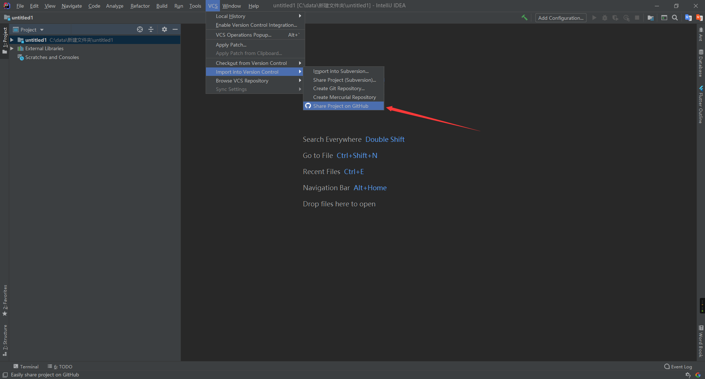

这一步如果你还没登陆的话会要求你登陆，我这已经登陆了所以直接弹出了这个框，点击share就会帮你在本地执行`git init` `git add .` `git add remote` 你的github里面创建仓库并把你的整个工程传上去，一把梭爽不爽 爽

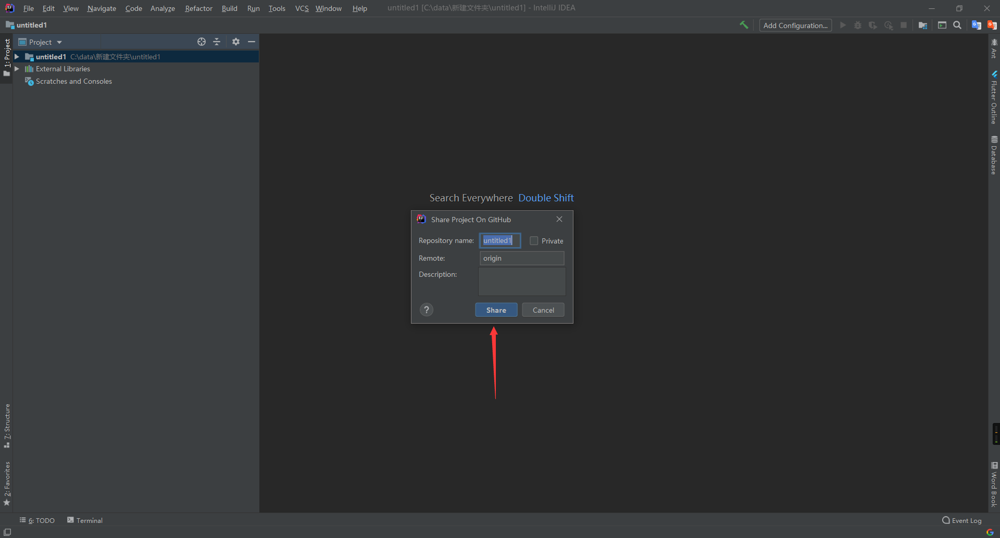


好了正式开始你的程序员生活了，如何拉网络去你仓库的更新呢？只需  **点**   **点 **   **点**

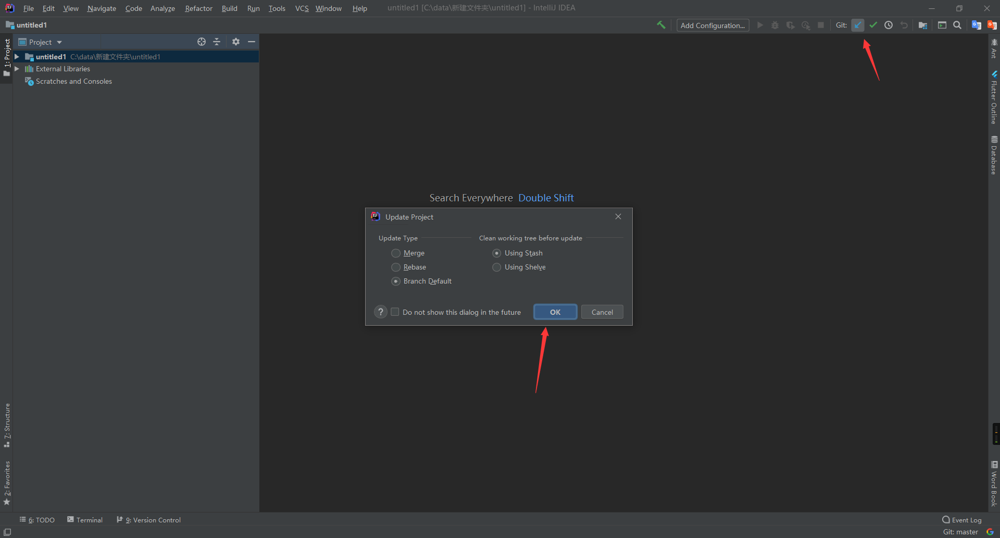

其实拉取对现阶段的你们还没啥用，毕竟远程的就是你本地的本地提交的，但是你和别人合作开发的时候就需要拉取了，为啥呢，因为可能他改了之后提交到远程了呀，你需要更新本地到远程的最新版


那如何提交呢？ 只需要  **点  点  点** 

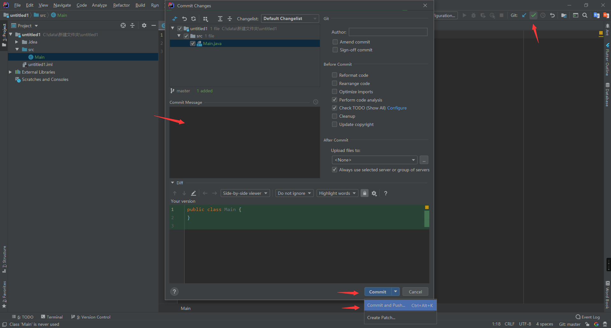

中间那个大框框里写你这次提交描述，点击下面的，commit就会提交到本地的版本库，你要是想提交到版本库之后直接把代码更新到远程github的仓库里，右边那个小三角，然后commit and push，提交到本地时同时上传远程，会出现，如下页面：

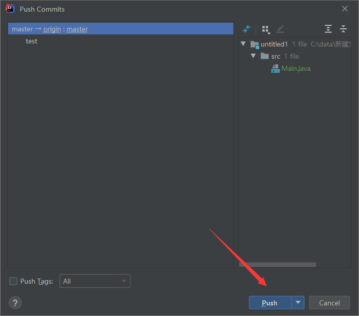

点击push就可以了。


那么问题来了，要是你就想直接commit在本地，等今天工作完了，再push到远程呢？只需   **点**   **点**    **点**

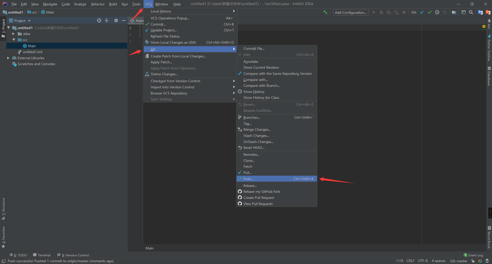

好了 ，现在为止你已经会了基本的git操作，是不是超简单。


好了我来学习更多的git操作，对你自己说，**”我  。 才  。  不  。  要  。   记  。   命  。  令。“**

假如你现在突发奇想有另外一个想法，想创建一个测试分支，来写那个功能，咋啦呢？ 只需  **点    点    点**

 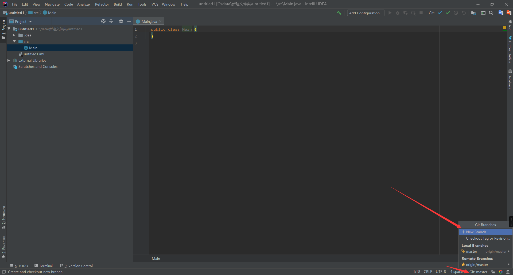

点击最下面的git 就能唤出这个窗口，这个英文应该大家都能看懂吧，这个英文看不懂就退群吧，思考一下怎么上大学几个月就把高中英语忘完了。


好了然后，你写了很多了，也提交了几次之后，你突然发现前面提交的那个有问题，不想提交了那咋办呢？ 只需**点    点    点**

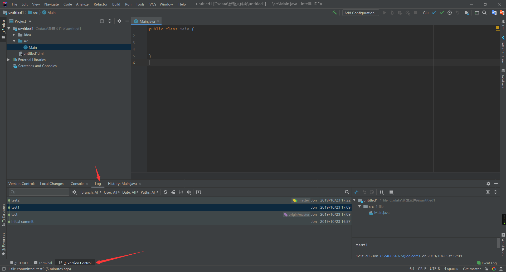

那就退到你刚刚新提交的那个版本前面一个呗，例如我觉得`test2`有问题那我就右键点击`test1`，然后

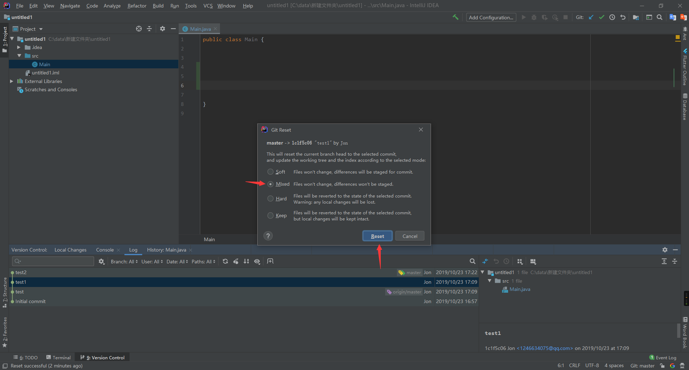

这样你刚刚的修改的提交就没了，但是如果你选择的时mix的话，你的修改还是会在的，变成没有提交状态了，我来解释一下这四个选项。

* `soft`重置版本库但是暂存区和工作区不会
* `mixed`会充值版本库和暂存区，但是工作区还在
* `hard`会重置版本库暂存区工作区（危险操作，但是找都是可以找回来的）
* `keep`重置所有的但是会保留文件


如果你完全不要本地的所有更改了，可以直接hard到最近一个commit（危险操作，虽然我经常做）


好了现在假如你完成了你突发奇想的功能感觉还不错，想把test分支合并到主分支要咋办呢？ 还是**点    点    点**

先切换回主分支

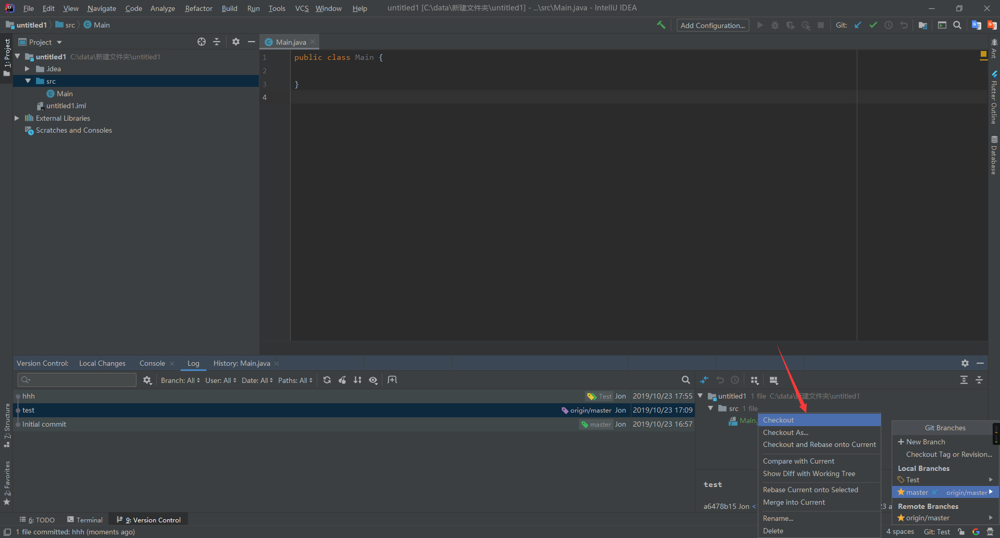

然后

点击test分支

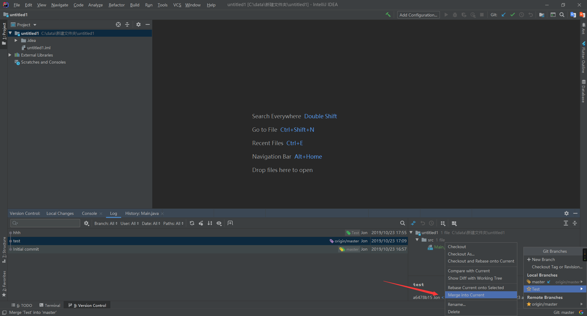

这样就合并啦

这也太简单了吧


