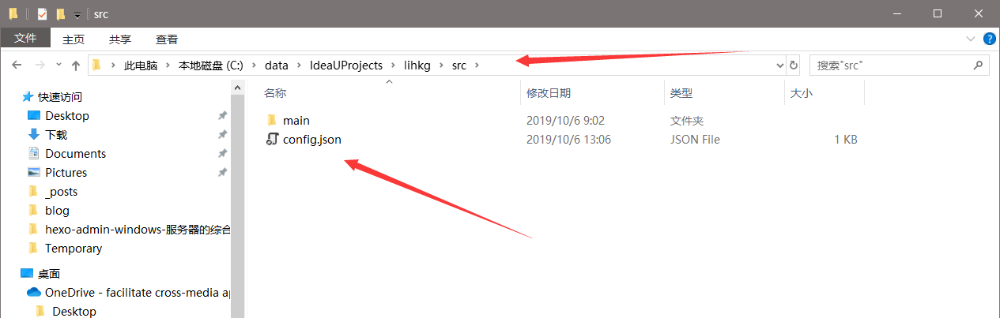

tags:
  - 闲来无事
categories:
  - 文档
author: Jon
date: 2019-10-06 17:46:00
---

---
## Api文档

**baseUrl：`host:port/lihkg`**

**以下所有链接均需要加上baseUrl**


### 配置文件

`config.json`配置文件

```json
{ 
    "filePath" : "C:\\data\\IdeaUProjects\\lihkg\\data", 
    
    "outputPath" : "C:\\data\\IdeaUProjects\\lihkg\\outData"
}
```

* filePath ：数据存放目录，所有需要解析的文件需要放到这个目录，请根据实际情况设置绝对路径
* outputPath：解析后文件输出目录，所有解析完成的数据都会存放到这个地方，请根据实际情况设置绝对路径

### 初始化接口

* url：`/resolve`

* 说明：

  > 访问该接口会把数据目录里面所有的文件进行解析，数据文件夹务必全部放所需要解析的文件，不可放文件夹，否则可能解析失败，解析完成会把解析完成的数据放置在输出目录


### 数据获取接口

* url：`/keyword` （关键词解析数据）

* url：`/organization` (组织解析数据)

* url：`/place` （地名解析数据）

* 参数 ：（以上三个接口参数均如下）

  | key    | value       | 描述                                                         |
  | ------ | ----------- | ------------------------------------------------------------ |
  | single | true\|false | 不加参数默认为false，返回数据会根据文件将关键词分开，true将把所有关键词统一返回，不区分文件 |


## 注意

* src文件夹下的config.json需要单独配置，请在打包前在请根据你服务器的文件目录更改`ResolveServlet.java`行的`configPath`属性为你部署之后的配置文件的绝对路径。

  例：

  ```java
  static String configPath = "C:\\data\\IdeaUProjects\\lihkg\\src\\config.json";
  ```

* 打包部署完毕后请将配置文件放在你上一步填写的路径上




**github自行提取：[github链**接](https://github.com/Treeeeeeee/lihkg)