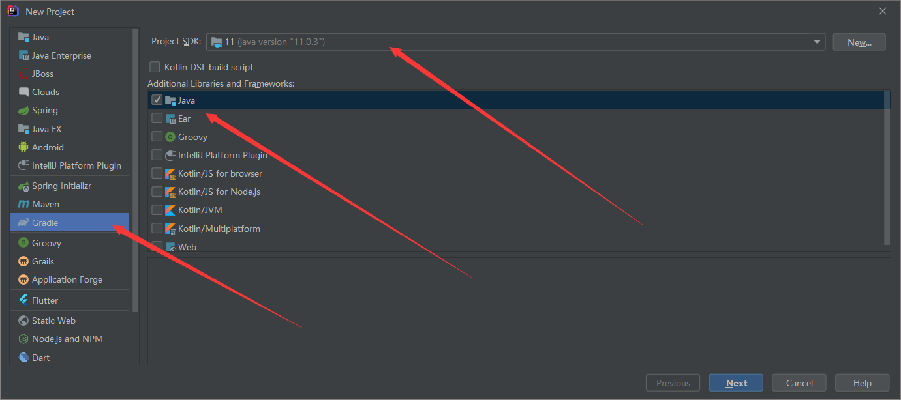
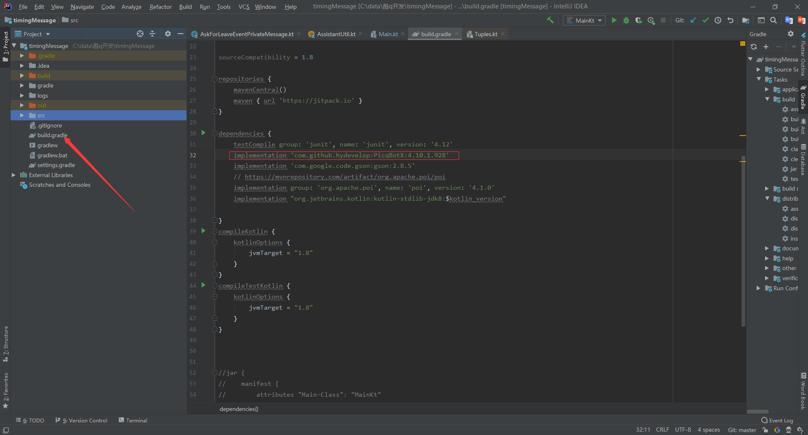
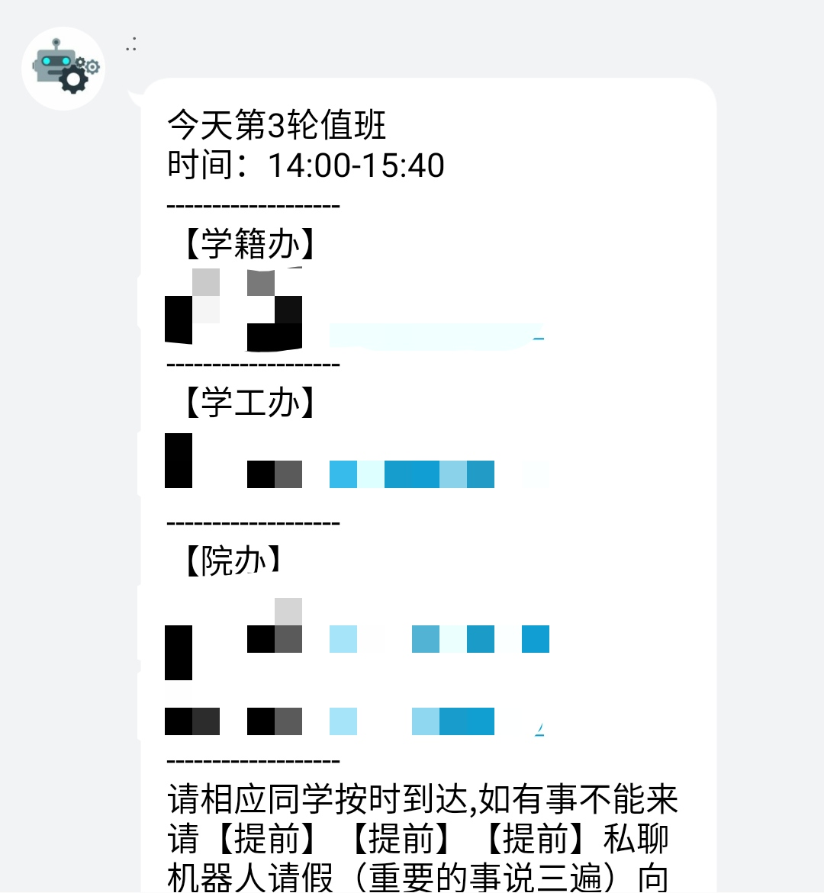
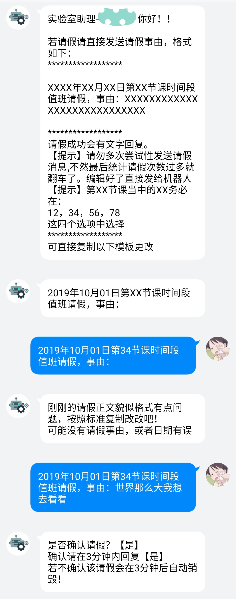
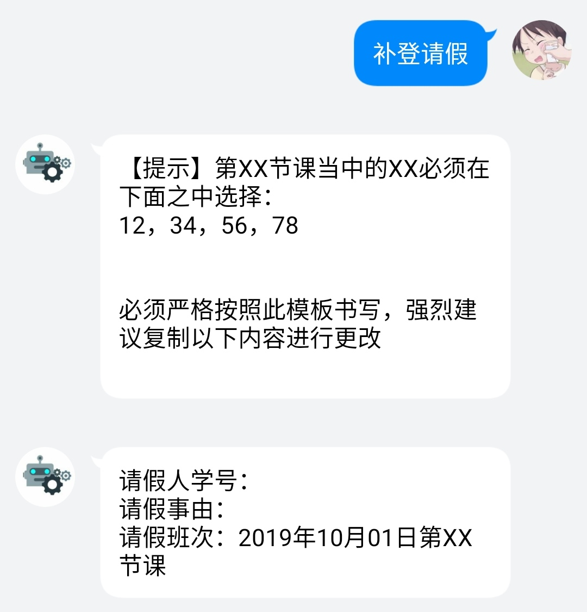

## 酷Q机器人

***********************

**自从samrtQQ下线之后，很多QQ机器人都失效了。**

**但是最近又比较想用这样一个机器人来管理减轻自己的一些工作，于是千方百计的我发现了酷Q。**

**这里附上[官网链接](https://cqp.cc/)**

### 开发以及注意事项
1. ##### SDK的选择

   酷q提供了多种[SDK](https://cqp.cc/t/15124)但是都是我不常用的，官方的支持的SDK是E语言，这语言emmmm好，都好，写，都可以写。虽然提供了java的sdk但是java版本始终不是正统，咬牙学了一天E语言，最后还是吐了。没办法，不习惯，没说E语言不好。害，最后还是选择的java版本。不过但是还没开始使用的时候我看到了更加好用的一个找到一个更加好用方便的SDK-[PicqBotX](https://github.com/HyDevelop/PicqBotX)，这是通过http的插件来与酷q的程序交互。虽然不能像官方网站上提供的那个那样可以直接打包成jar运行但是个人认为开发更加简单。

2. **环境以及配置细节**

   [这里讲得很清楚，以下说明几个坑](https://github.com/HyDevelop/PicqBotX)：

   * 如果使用kotlin代替java进行开发，请最好使用Gradle对项目进行管理，它对kotlin有更加完美的支持。

   * 

     在介绍readme中的这个位置一定要看准，下载对应版本的工具，否则可能出问题，比较麻烦，而且没有提示难以排查。

   * 两个端口号一定要对应于你程序中的机器人的端口号否则会链接失败（建议直接用默认的31091 31092，也可自己选择）


### 本人开发流程

1. 使用idea新建项目选择gradle管理项目java版本任意，需要kotlin开发勾选kotlin

2. 导包

   

   导入最新的sdk。

3. 根据需要复制示例代码更改

   ```java
   public class TestBot
   {
       public static void main(String[] args)
       {
           // 创建机器人对象 ( 传入配置 )
           PicqBotX bot = new PicqBotX(new PicqConfig(31092).setDebug(true));
   
           // 添加一个机器人账户 ( 名字, 发送URL, 发送端口 )
           bot.addAccount("Bot01", "127.0.0.1", 31091);
   
           // 注册事件监听器, 可以注册多个监听器
           bot.getEventManager().registerListeners(
                   new TestListener(), 
                   new RequestListener(),
                   new ExceptionListener()
           );
   
           // 启用指令管理器
           // 这些字符串是指令前缀, 比如指令"!help"的前缀就是"!"
           bot.enableCommandManager("bot -", "!", "/", "~");
   
           // 注册指令, 可以注册多个指令
           bot.getCommandManager().registerCommands(
                   new CommandSay(),
                   new CommandTest(),
                   new CommandVersion()
           );
   
           // 启动机器人, 不会占用主线程
           bot.startBot();
       }
   }
   ```


### 个人实现效果和功能

- 通知功能

  

- 请假功能

  有学生请假则会以json格式文本保存在服务器（或者本地）

  

- 导出请假表格文档，会直接给下载链接

  

- 补登请假

  

- 还有安卓端的管理app和网页版实时查看数据。


### 部署机器人


### 用到的库

*********************************

* 阿帕奇的表格框架
* gson

通知管理机器人源代码地址：[冷漠无情的机器人]()

因为源代码中有不少私人数据，所以取消。

